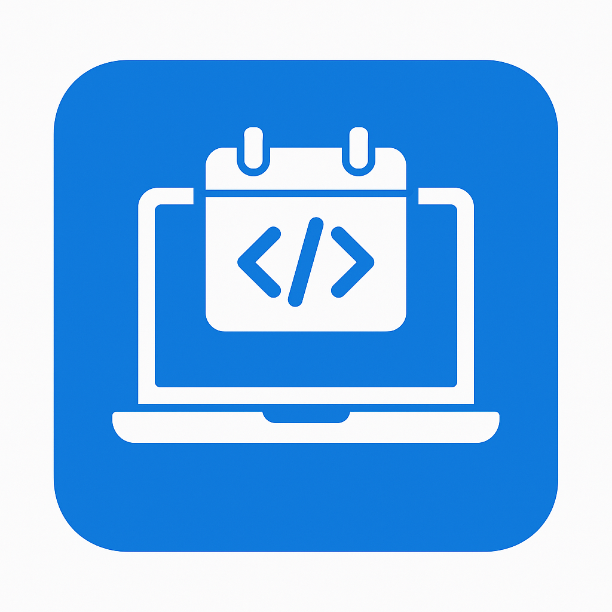

# 🧩 Daily Code Widget (Chrome Extension)

A simple and elegant Chrome extension that shows you a random coding challenge daily from platforms like LeetCode and Codeforces — right from your browser!



## ⚡ Features

- Displays a new coding challenge each day
- Supports LeetCode and Codeforces problems
- Lightweight popup UI with LeetCode-like theme
- One-click access to the full question page

## 📁 Project Structure

```plaintext
📦Daily_Code_Widget
 ┣ 📄manifest.json        → Chrome extension metadata
 ┣ 📄popup.html           → HTML for popup window
 ┣ 📄popup.js             → Script to load random questions
 ┣ 📄style.css            → LeetCode-themed UI styling
 ┣ 📄questions.json       → Question data (LeetCode + Codeforces)
 ┗ 📄icon.png             → Extension icon
